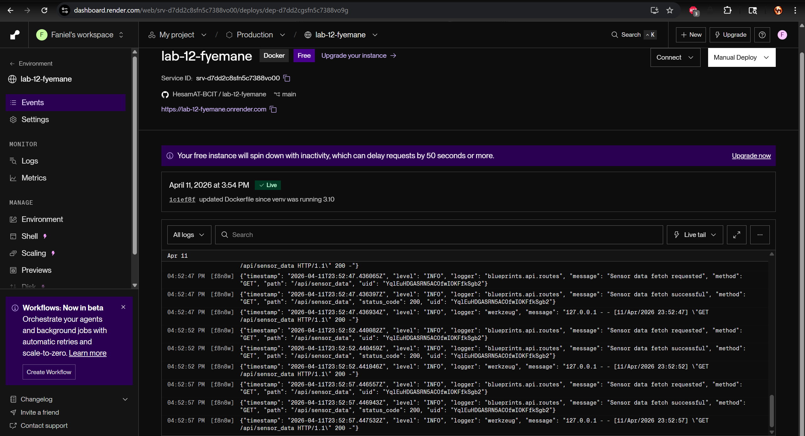
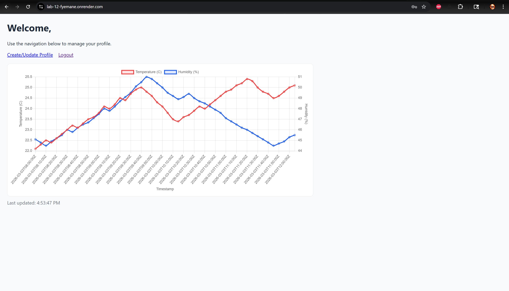
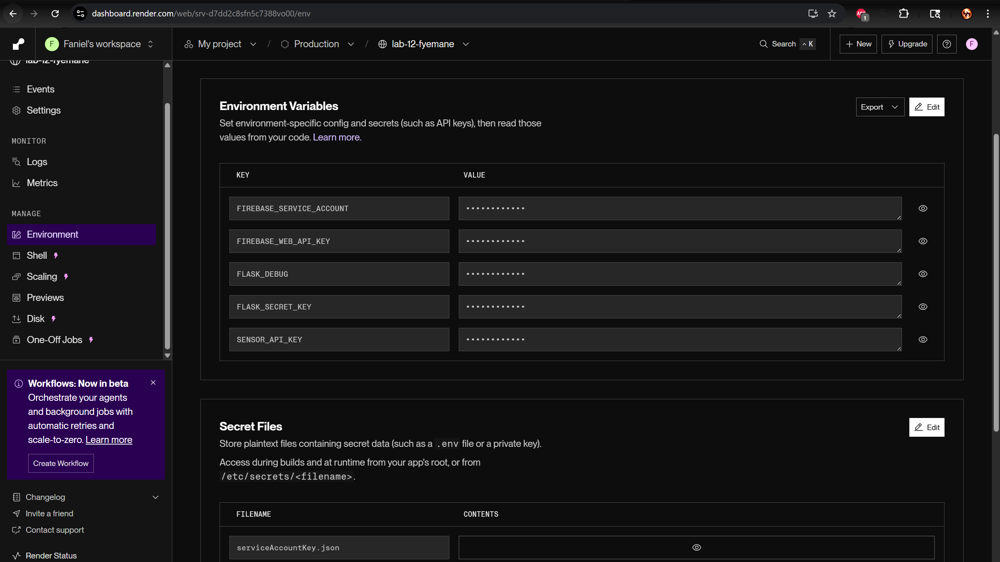

# Lab 12 – Flask Application Deployment

## 🔗 Repository
https://github.com/HesamAT-BCIT/lab-12-fyemane  

## 🌐 Deployed Application
https://lab-12-fyemane.onrender.com/  

---

## 🔐 Environment Variables

Configured in Render:

- FLASK_SECRET_KEY  
- FIREBASE_WEB_API_KEY  
- SENSOR_API_KEY  
- FIREBASE_SERVICE_ACCOUNT  

---

## 📸 Deployment Proof

### ✅ Render Deployment Logs

---

### ✅ Application Running

---

### ✅ Environment Variables
